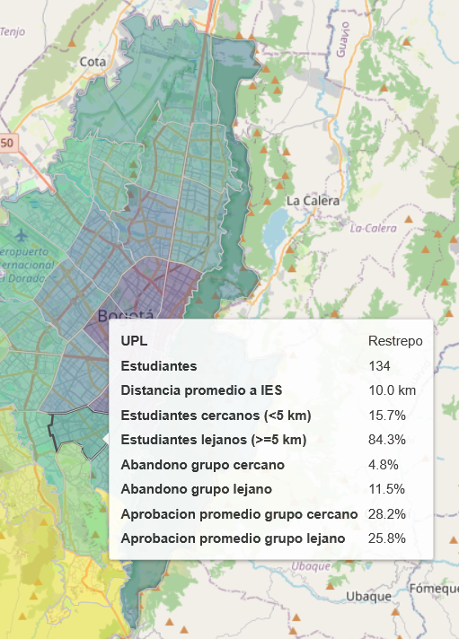
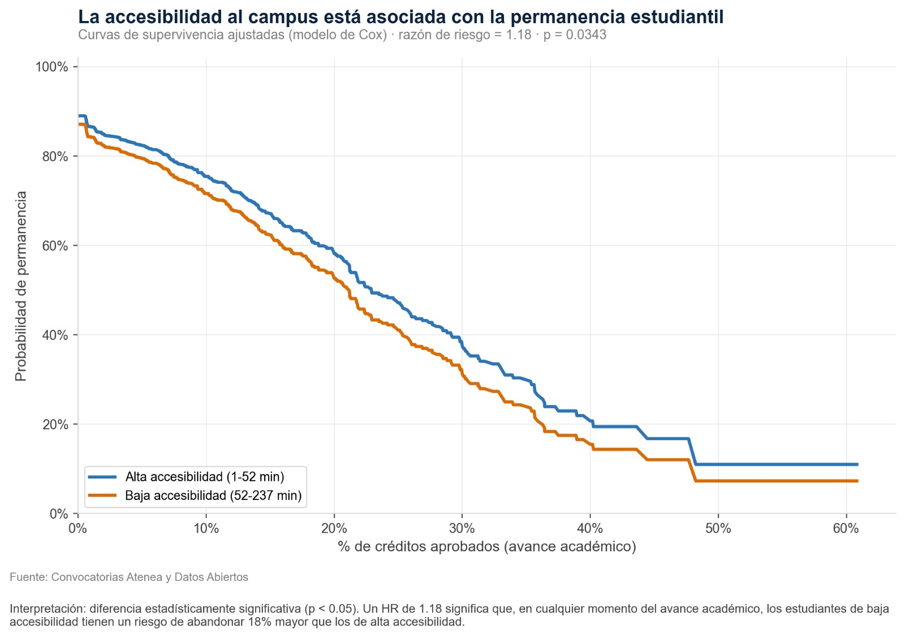

## Problema

En Bogotá, existen diferencias en la accesibilidad física de los estudiantes de programas presenciales a las instituciones de educación superior. Estas diferencias podrían estar asociadas con menores niveles de rendimiento académico y una mayor probabilidad de abandono durante los primeros semestres académicos, limitando la formación de capital humano y el retorno social de la inversión educativa. 

Este proyecto explora si la distancia entre el domicilio del estudiante y su institución educativa, así como la accesibilidad al sistema de transporte público, presentan asociaciones con indicadores de desempeño académico. El objetivo es aportar evidencia descriptiva que contribuya a comprender posibles barreras geográficas para la permanencia estudiantil y la formación de capital humano.

---

## Fuentes de datos utilizadas

* **Instituciones de Educación Superior (IES):** https://datosabiertos.bogota.gov.co/dataset/institucion-de-educacion-superior
* **Paraderos del componente zonal (SITP):** https://datosabiertos.bogota.gov.co/dataset/informacion-general-rutas-componente-troncal-del-sitp
* **Estaciones troncales de TransMilenio:** https://datosabiertos.bogota.gov.co/dataset/estaciones-troncales-de-transmilenio
* **Base administrativa de beneficiarios de Atenea**, que contiene información académica y geográfica anonimizada de los estudiantes.
* **Feed GTFS (General Transit Feed Specification) del SITP y TransMilenio**: descargado desde el Portal de Datos Abiertos de TransMilenio (el Portal de Datos Abiertos de Bogotá redirige a este repositorio para este conjunto de datos). Se publica periódicamente como "GTFS Estáticos" e integra paraderos, rutas (`shapes`), viajes (`trips`) y horarios de paso (`stop_times`). Se usa como insumo para calcular rutas, distancias y tiempos de viaje en transporte público. Repositorio: https://datosabiertos-transmilenio.hub.arcgis.com/search?collection=Document&tags=gtfs
---

## Metodología

El proyecto realiza un análisis espacial, descriptivo y estadístico, para explorar la relación entre la accesibilidad geográfica y el desempeño académico de estudiantes universitarios en modalidad presencial.

Las principales actividades desarrolladas son:

* Calcular la distancia euclidiana entre el domicilio del estudiante y la Institución de Educación Superior (IES).
* Calcular el número de estaciones de TransMilenio y paraderos del SITP ubicados dentro de un radio de 800 metros alrededor del domicilio del estudiante como una aproximación a la accesibilidad al transporte público.
* Agregar indicadores espaciales a nivel de Unidad de Planeamiento Local (UPL), incluyendo distancia promedio a la IES, acceso al transporte público, tasas de abandono y porcentaje promedio de avance académico.
* Construir visualizaciones interactivas para explorar la distribución espacial de estos indicadores.
* Calcular estadísticas descriptivas y analizar la relación entre las variables de accesibilidad (distancia y transporte) y las variables de desempeño académico (abandono y porcentaje acumulado de créditos aprobados).
* Tiempo estimado de desplazamiento en transporte público.
* Distancia recorrida sobre la red vial y de transporte público.


### Cálculo de rutas, distancias y tiempos de viaje (GTFS)

Para obtener las variables de **distancia (km)** y **tiempo de viaje (min)** en transporte público entre el domicilio de cada estudiante y su IES, se construyó un motor de ruteo sobre el feed GTFS del SITP y TransMilenio:

1. **Carga e indexación del GTFS**: se leen en memoria las tablas `stops`, `shapes`, `trips`, `routes` y `stop_times`, lo que permite realizar búsquedas de horarios de forma rápida sin volver a leer disco por cada estudiante.
2. **Distancia a la red de transporte**: usando una proyección a un sistema de coordenadas métrico (EPSG:3116), se calcula para cada estudiante la ruta de transporte más cercana (`STRtree` sobre las geometrías de las rutas) y el paradero más cercano (`cKDTree` sobre las coordenadas de los paraderos).
3. **Búsqueda de la mejor conexión**: para cada estudiante se buscan, dentro de una ventana horaria definida (por ejemplo 4:00 a.m. – 10:00 a.m.), los viajes de `stop_times` que conectan un paradero cercano al domicilio con uno cercano a la IES. Se evalúan primero conexiones **directas** y, si no existen, conexiones **con un transbordo**, seleccionando siempre la de menor tiempo total.
4. **Variables generadas por estudiante**:
   * `dist_total_estimada_km`: distancia total estimada (caminata a la parada + tramo(s) en bus + caminata final).
   * `tiempo_total_min`: tiempo total de viaje puerta a puerta.
   * `ruta_info` / `transbordos`: ruta(s) de SITP o TransMilenio utilizadas y número de transbordos.
   * `link_maps`: enlace de verificación en Google Maps con el trayecto sugerido, para validación visual del resultado.
5. **Salida**: los resultados se consolidan en una tabla (`estudiantes_con_rutas`) que se une a la base de estudiantes original y alimenta el análisis descriptivo, espacial y estadístico posterior.


### Análisis descriptivo y estadístico (accesibilidad vs. permanencia)

A partir de la tabla generada en el paso anterior (`outputs/estudiantes_con_rutas.xlsx`), el notebook `analisis_descriptivo.ipynb` explora si la accesibilidad al campus está asociada con la permanencia y el desempeño académico:

1. **Grupos de accesibilidad**: se divide a los estudiantes en "Alta accesibilidad" y "Baja accesibilidad" según si su tiempo de viaje está por debajo o por encima de la mediana.
2. **Curvas de supervivencia (Kaplan-Meier)**: se usa el % de créditos aprobados como proxy del avance académico y `ABANDONA` como evento, comparando ambos grupos con una prueba log-rank.
3. **Modelo de riesgos proporcionales de Cox**: ajusta las curvas de supervivencia por el nivel de accesibilidad y estima una razón de riesgo (hazard ratio) de abandono.
4. **Distribución del tiempo de viaje** según estado del estudiante (activo/abandona), a nivel general, por localidad y por UPZ.
5. **Relación tiempo de viaje vs. % de créditos aprobados**, con línea de tendencia y paneles por localidad.





---

## Estructura del repositorio

* **src/**: código fuente del proyecto, incluyendo scripts y notebooks de análisis.
* **data/**: datos requeridos para la ejecución. Solo se incluyen los paraderos del SITP, ya que el resto de la información pública se consulta directamente mediante servicios REST. Los archivos administrativos de Atenea no se comparten por ahora debido a restricciones de tamaño
* **data/raw/**: Aquí se encuentra:
1 - El feed GTFS del SITP/TransMilenio excede los limites para subirlo al repositorio
2 - Datos de los estudiantes crudos para calcular los trayectos y distancias de los estudiantes en el transporte público. 
* **figures/**: figuras generadas durante el análisis descriptivo.
* **outputs/**: tablas, archivos HTML, mapas y demás resultados generados por el proyecto.

---

## Instrucciones de ejecución

El proyecto se divide en dos etapas principales.

### 1. Análisis descriptivo y espacial

Esta etapa construye el panel de datos enriquecido, realiza el análisis exploratorio y genera el visor geográfico interactivo.

#### Componentes

* **`src/src_panel_basico.ipynb`**
  Construye el panel de datos base, incorporando para cada estudiante:

  * Distancia euclidiana entre el domicilio y la Institución de Educación Superior (IES).
  * Número de paraderos del SITP cercanos.
  * Número de estaciones de TransMilenio cercanas.

* **`src/analisis_descriptivo.ipynb`**
  Realiza el análisis exploratorio de datos (EDA), incluyendo estadísticas descriptivas, visualizaciones y análisis de correlación entre los indicadores de accesibilidad geográfica (`distancia_ies`, `acceso_transporte`) y las variables de desempeño académico (`pct_aprob_acum` y `estado`).

* **`src/generar_visor_upl.py`**
  Genera un visor geográfico interactivo con indicadores agregados por Unidad de Planeamiento Local (UPL). El visor incluye:

  * Indicadores espaciales agregados por UPL.
  * Una muestra anonimizada de los domicilios de los estudiantes (mediante desplazamiento aleatorio de las ubicaciones para preservar la privacidad).
  * Instituciones de Educación Superior (IES).
  * Paraderos del SITP.
  * Estaciones de TransMilenio.

#### Orden de ejecución

Desde el directorio `src`, ejecutar los componentes en el siguiente orden:

1. `src_panel_basico.ipynb`
2. `analisis_descriptivo.ipynb`
3. Desde la terminal:

```bash
python generar_visor_upl.py
```

---

### 2. Inferencia estadística

* **src/rutas_distancias_tiempo.ipynb**: calcula, a partir del feed GTFS del SITP/TransMilenio y las coordenadas de vivienda y de la IES de cada estudiante, la mejor conexión en transporte público (directa o con un transbordo) dentro de una ventana horaria definida. Genera como salida la distancia total estimada (km) y el tiempo total de viaje (min) por estudiante, insumos que luego usa el análisis descriptivo. **Debe ejecutarse antes** que `analisis_descriptivo.ipynb`, ya que produce el archivo (`outputs/estudiantes_con_rutas.xlsx`) con las variables de distancia y tiempo que este último consume.

* **src/analisis_descriptivo_inferencia.ipynb**: Ejecuta el análisis exploratorio, las estadísticas descriptivas y las visualizaciones utilizadas en el estudio de los indicadores de: 'acceso al transporte', 'Distancia a la IES' y su correlación con el '% aprobación acumulada', estado ('abandono', 'matriculado'). Lee automáticamente `outputs/estudiantes_con_rutas.xlsx` y renombra internamente las columnas `conn_*` generadas por el notebook anterior a los nombres que usa el análisis (`TOTAL_KM`, `TOTAL_TIEMPO`, `TOTAL_TRANSBORDOS`), por lo que no requiere edición manual del Excel. Si el archivo de origen no trae alguna columna esperada (por ejemplo variables académicas de Atenea como `ABANDONA`, `SEXO`, `LOCALIDAD`, `UPZ`), el notebook lo indica explícitamente al inicio en vez de fallar más adelante con un error críptico. Guarda 10 figuras en `figures/`.

#### Orden de ejecución

Desde el directorio `src`, ejecutar los componentes en el siguiente orden:

1. `rutas_distancias_tiempo.ipynb`
2. `analisis_descriptivo_inferencia.ipynb`


